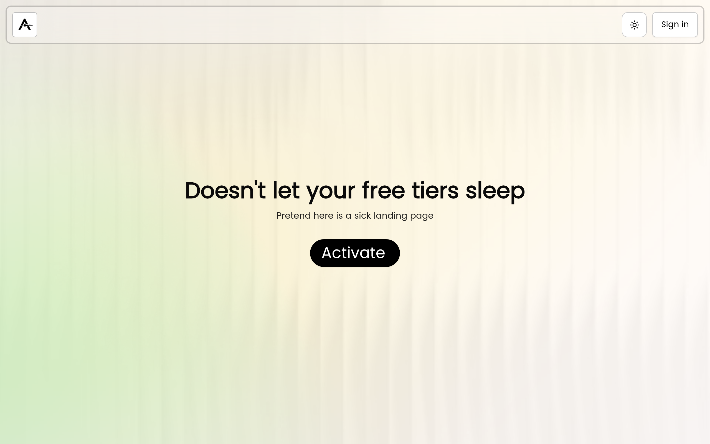
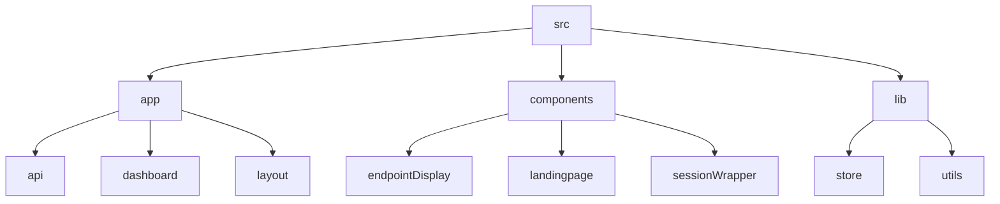

# Lazy Ping: A Simple Pinging Service 🤖

## 🗂️ Description

Lazy Ping is a simple web application that provides a pinging service. It allows users to create projects, add endpoints, and ping them to test their availability. The application uses Next.js, Supabase, and NextAuth for authentication and authorization.

The project aims to provide a straightforward and easy-to-use pinging service for developers and system administrators.

## ✨ Key Features

### **Core Features**

* **Project Management**: Create and manage projects with multiple endpoints.
* **Endpoint Management**: Add, edit, and delete endpoints for each project.
* **Pinging Service**: Ping endpoints to test their availability.
* **Authentication and Authorization**: Secure authentication and authorization using NextAuth and Supabase.

### **UI Features**

* **Dashboard**: A user-friendly dashboard to manage projects and endpoints.
* **Tabbed Interface**: A tabbed interface to display projects, create new projects, and view API endpoints.

## 🗂️ Folder Structure

## 🛠️ Tech Stack

## ⚙️ Setup Instructions

To run the project locally, follow these steps:

* Git clone the repository: `https://github.com/abhraneeldhar7/lazy-ping.git`
* Install dependencies: `npm install`
* Start the development server: `npm run dev`
* Open your browser and navigate to `http://localhost:3000`

## 🤖 API Endpoints

The application provides several API endpoints for pinging and managing projects and endpoints.

* **Ping Endpoint**: `/api/ping`
* **Project Endpoints**: `/api/projects`

## 📝 State Management

The application uses Zustand for state management.

* **Store**: `lib/store.ts`

## 🔒 Authentication and Authorization

The application uses NextAuth for authentication and authorization.

* **NextAuth Configuration**: `app/api/auth/[...nextauth]/options.ts`

## 🚀 Deployment

The application is deployed using GitHub Actions.

* **GitHub Actions Workflow**: `.github/workflows/ping.yml`

  

<h3>Abhra the Neel</h3>

Full-stack developer with expertise in web, Android, and server-side development. Most projects are private due to their production nature.

 

  <a href="https://gitfull.vercel.app">Made by GitFull</a>

    