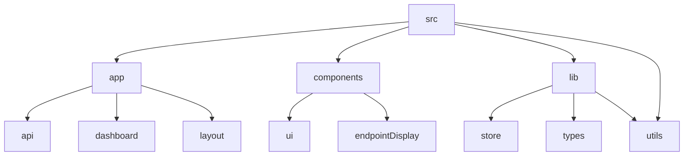

# Lazy Ping: Automated Endpoint Pinger

## 🗂️ Description

Lazy Ping is a web application designed to automate the process of pinging endpoints at regular intervals. The project aims to provide a simple and efficient way to monitor endpoint availability and performance. It is built using Next.js, Supabase, and Tailwind CSS, making it a modern and scalable solution.

The application allows users to create projects, add endpoints, and configure ping intervals. It also provides features like authentication, authorization, and logging. The project is designed for developers, DevOps teams, and anyone who needs to monitor endpoint availability.

## ✨ Key Features

### **Core Features**
* **Endpoint Management**: Add, edit, and delete endpoints
* **Project Management**: Create and manage projects
* **Ping Scheduling**: Configure ping intervals
* **Authentication**: Secure login and authorization

### **UI Features**
* **Dashboard**: View projects, endpoints, and ping history
* **Tabbed Interface**: Easy navigation between projects and endpoints

### **Backend Features**
* **Supabase Integration**: Interact with Supabase database
* **API Logging**: Log ping responses and errors

## 🗂️ Folder Structure

## 🛠️ Tech Stack

* Next.js
* Supabase
* Tailwind CSS
* TypeScript
* ESLint
* PostCSS
* Zustand

## ⚙️ Setup Instructions

* Git clone: https://github.com/abhraneeldhar7/lazy-ping.git
* Install dependencies: `npm install`
* Start development server: `npm run dev`
* Build and deploy: `npm run build` and `npm run deploy`

* Make sure to configure environment variables for Supabase and NextAuth.