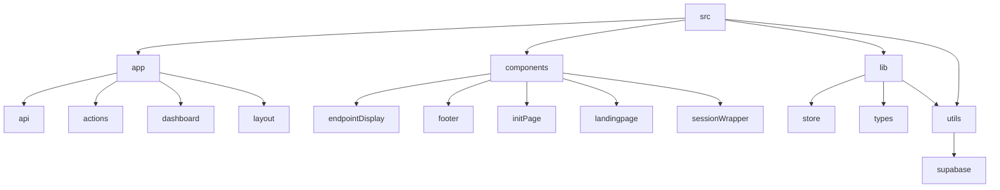

# Lazy Ping

## 🗂️ Description

Lazy Ping is a web application designed to monitor and ping endpoints at regular intervals. The project utilizes Next.js, Supabase, and NextAuth to provide a robust and scalable solution. It's ideal for developers and teams who need to keep track of their API endpoints' status.

The application allows users to create projects, add endpoints, and monitor their status. It also features authentication and authorization, ensuring that only authorized users can access and manage their projects.

With its intuitive interface and automated pinging feature, Lazy Ping helps users stay on top of their API endpoints' performance and reliability.

## ✨ Key Features

### **Core Features**
* **Project Management**: Create and manage projects with ease
* **Endpoint Monitoring**: Add and monitor API endpoints
* **Automated Pinging**: Ping endpoints at regular intervals
* **Authentication and Authorization**: Secure access with NextAuth and role-based access control

### **User Interface**
* **Dashboard**: View and manage projects and endpoints
* **Project Details**: View and edit project details
* **Endpoint Display**: View and manage endpoint details

## 🗂️ Folder Structure

## 🛠️ Tech Stack

* **Next.js**: A popular React framework for building server-rendered and statically generated websites and applications
* **Supabase**: A PostgreSQL-based database with a suite of tools for building scalable and secure applications
* **NextAuth**: A popular authentication library for Next.js
* **TypeScript**: A statically typed programming language for building scalable and maintainable applications
* **Tailwind CSS**: A utility-first CSS framework for building custom and responsive user interfaces

## ⚙️ Setup Instructions

* Git clone the repository: https://github.com/abhraneeldhar7/lazy-ping.git
* Install dependencies: `npm install` or `yarn install`
* Create a `.env` file and add your Supabase and NextAuth credentials
* Run the application: `npm run dev` or `yarn dev`
* Open your browser and navigate to `http://localhost:3000` to access the application