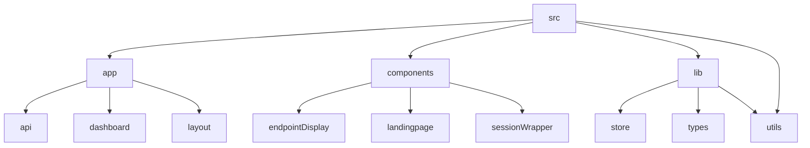

# Lazy Ping: Endpoint Monitoring Made Easy 🚀

## 🗂️ Description

Lazy Ping is a web application designed to simplify endpoint monitoring and management. It allows users to create projects, add endpoints, and ping them at regular intervals to ensure they are functioning correctly. The application provides a user-friendly interface for managing projects and endpoints, as well as features like authentication and role-based access control.

## ✨ Key Features

### **Core Features**

* **Project Management**: Create and manage projects with multiple endpoints
* **Endpoint Management**: Add, edit, and delete endpoints for each project
* **Ping Endpoints**: Ping endpoints at regular intervals to ensure they are functioning correctly
* **API Logs**: View logs of API responses for each endpoint

### **Authentication and Authorization**

* **Google Authentication**: Authenticate users with Google
* **Role-Based Access Control**: Control access to projects and endpoints based on user roles

## 🗂️ Folder Structure

## 🛠️ Tech Stack

## ⚙️ Setup Instructions

To run the project locally, follow these steps:

* Clone the repository: `git clone https://github.com/abhraneeldhar7/lazy-ping.git`
* Install dependencies: `npm install` or `yarn install`
* Start the development server: `npm run dev` or `yarn dev`

## 🤖 GitHub Actions

The project uses a GitHub Actions workflow to ping endpoints every 10 minutes. The workflow is defined in `.github/workflows/ping.yml`.

## 📝 Configuration

The project uses several configuration files, including:

* `next.config.ts`: Configures Next.js
* `postcss.config.mjs`: Configures PostCSS
* `.eslintrc.json`: Configures ESLint
* `tsconfig.json`: Configures TypeScript

## 📊 Supabase

The project uses Supabase as its backend. The Supabase client instance is created in `utils/supabase/client.ts`. The project uses several Supabase functions to interact with the database, including functions for user management, project management, and endpoint management. These functions are defined in `app/actions/supabaseFunctions.ts`.

  

<h3>Abhra the Neel</h3>

Full-stack developer with expertise in web, Android, and server-side development, currently working on private projects.

 

  <a href="https://gitfull.vercel.app">Made by GitFull</a>

    