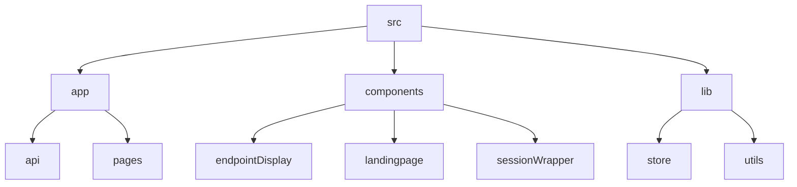

# Lazy Ping - Automated Endpoint Pinger

## 🗂️ Description

Lazy Ping is a web application designed to automate the process of pinging endpoints at regular intervals. The application allows users to create projects, add endpoints, and configure ping intervals. It uses Next.js, Supabase, and NextAuth to provide a robust and scalable solution.

The application is ideal for developers and DevOps teams who need to monitor the availability and responsiveness of their API endpoints. With Lazy Ping, users can easily set up and manage their endpoint pinging tasks, ensuring that their APIs are always up and running.

## ✨ Key Features

### **Endpoint Management**
* Add, edit, and delete endpoints
* Configure ping intervals and timeouts
* View ping history and logs

### **Project Management**
* Create and manage projects
* Add and remove endpoints from projects
* View project details and settings

### **Authentication and Authorization**
* User authentication using NextAuth
* Role-based access control for project management

### **Supabase Integration**
* Use Supabase for data storage and retrieval
* Leverage Supabase functions for server-side operations

## 🗂️ Folder Structure



## 🛠️ Tech Stack


## ⚙️ Setup Instructions

To run the project locally, follow these steps:

* Clone the repository: `git clone https://github.com/abhraneeldhar7/lazy-ping.git`
* Install dependencies: `npm install` or `yarn install`
* Create a `.env` file and add your Supabase and NextAuth credentials
* Run the application: `npm run dev` or `yarn dev`

## 🧪 GitHub Actions

The project uses a GitHub Actions workflow to ping endpoints every 10 minutes. The workflow is defined in `.github/workflows/ping.yml`.

```yml
name: Ping Endpoints

on:
  schedule:
    - cron:  */10 * * * *

jobs:
  ping:
    runs-on: ubuntu-latest
    steps:
      - name: Ping Endpoints
        run: curl https://lazy-ping.vercel.app/api/ping
```

## 📝 API Documentation

The application exposes several API endpoints for pinging, project management, and authentication. These endpoints are documented in the code and can be accessed using tools like Postman or cURL.

## 💻 Code Structure

The codebase is organized into several folders:

* `app`: Contains pages, API routes, and server-side functions
* `components`: Contains reusable UI components
* `lib`: Contains utility functions and store definitions
* `utils`: Contains utility functions for working with Supabase and NextAuth

The code uses TypeScript, Next.js, and Supabase to provide a robust and scalable solution.


<br><br>
<div align="center">

<h3>Abhra the Neel</h3>
<p>Full-stack developer with expertise in web, Android, and server-side development. Most projects are private due to their production nature.</p>
</div>
<br>
<p align="right">
  <a href="https://gitfull.vercel.app">Made by GitFull</a>
</p>
    