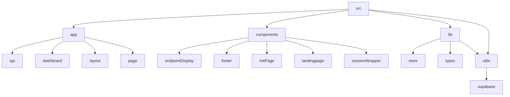

# Lazy Ping - Automated Endpoint Pinger

## 🗂️ Description

Lazy Ping is a web application designed to automate the process of pinging API endpoints at regular intervals. The application allows users to create projects, add endpoints, and monitor their status. It uses Next.js, Supabase, and NextAuth for authentication and data storage.

The application provides a user-friendly interface for managing projects and endpoints. Users can create new projects, add endpoints, and view their status. The application also includes features for authentication and authorization, ensuring that only authorized users can access and manage their projects.

Lazy Ping aims to simplify the process of monitoring API endpoints, providing a reliable and efficient solution for developers and teams.

## ✨ Key Features

### **Core Features**
* **Project Management**: Create and manage projects with multiple endpoints
* **Endpoint Management**: Add, edit, and delete endpoints for each project
* **Endpoint Status**: View the status of each endpoint, including response times and error messages
* **Authentication**: Secure authentication using NextAuth and Supabase

### **Automation Features**
* **Scheduled Pinging**: Automatically ping endpoints at regular intervals (every 10 minutes)
* **Logging**: Store logs of ping attempts, including response times and error messages

## 🗂️ Folder Structure

## 🛠️ Tech Stack

* Next.js
* React
* Supabase
* NextAuth
* Tailwind CSS
* TypeScript
* Zustand

## ⚙️ Setup Instructions

* Git clone the repository: https://github.com/abhraneeldhar7/lazy-ping.git
* Install dependencies: `npm install` or `yarn install`
* Start the development server: `npm run dev` or `yarn dev`
* Open the application in your browser: `http://localhost:3000`

Note: Make sure to set up your Supabase instance and NextAuth configuration to use the application.