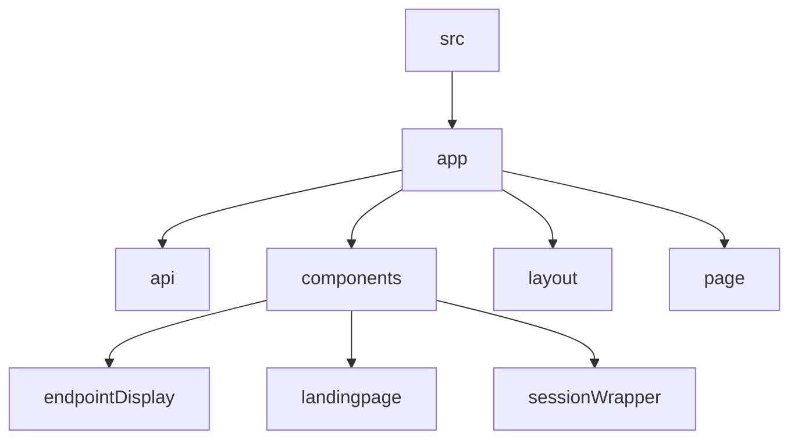

# Lazy Ping
## 🗂️ Description

Lazy Ping is a web application designed to simplify endpoint monitoring and management. It allows users to create projects, add endpoints, and receive pings at regular intervals. The application is built using Next.js, TypeScript, and Supabase, providing a robust and scalable solution for monitoring API endpoints.

The application caters to developers, DevOps teams, and anyone who needs to monitor API endpoints. With Lazy Ping, users can easily create projects, add endpoints, and view API responses. The application also features authentication and authorization, ensuring that only authorized users can access and manage projects.

## ✨ Key Features

### **Endpoint Management**
* Create and manage projects
* Add, edit, and delete endpoints
* View API responses

### **Authentication and Authorization**
* Google authentication using NextAuth
* Role-based access control

### **Monitoring and Alerts**
* Ping endpoints at regular intervals
* Receive notifications (not implemented)

## 🗂️ Folder Structure


## 🛠️ Tech Stack

* Next.js
* TypeScript
* Supabase
* Tailwind CSS
* clsx
* tailwind-merge
* Zustand
* ESLint
* Prettier

## ⚙️ Setup Instructions

* Git clone the repository: https://github.com/abhraneeldhar7/lazy-ping.git
* Install dependencies: `npm install` or `yarn install`
* Create a `.env` file with the required environment variables:
+ `SUPABASE_URL`
+ `SUPABASE_SERVICE_ROLE_KEY`
+ `NEXTAUTH_SECRET`
+ `GOOGLE_CLIENT_ID`
+ `GOOGLE_CLIENT_SECRET`
* Run the application: `npm run dev` or `yarn dev`

## Getting Started

First, run the development server:

```bash
npm run dev
# or
yarn dev
# or
pnpm dev
# or
bun dev
```

Open [http://localhost:3000](http://localhost:3000) with your browser to see the result.

You can start editing the page by modifying `app/page.tsx`. The page auto-updates as you edit the file.

This project uses [`next/font`](https://nextjs.org/docs/app/building-your-application/optimizing/fonts) to automatically optimize and load [Geist](https://vercel.com/font), a new font family for Vercel.

## Learn More

To learn more about Next.js, take a look at the following resources:

- [Next.js Documentation](https://nextjs.org/docs) - learn about Next.js features and API.
- [Learn Next.js](https://nextjs.org/learn) - an interactive Next.js tutorial.

You can check out [the Next.js GitHub repository](https://github.com/vercel/next.js) - your feedback and contributions are welcome!

## Deploy on Vercel

The easiest way to deploy your Next.js app is to use the [Vercel Platform](https://vercel.com/new?utm_medium=default-template&filter=next.js&utm_source=create-next-app&utm_campaign=create-next-app-readme) from the creators of Next.js.

Check out our [Next.js deployment documentation](https://nextjs.org/docs/app/building-your-application/deploying) for more details.
