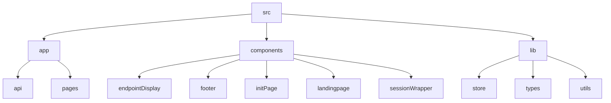

# Lazy Ping - Automated Endpoint Testing and Monitoring

## 🗂️ Description

Lazy Ping is an open-source project designed to automate endpoint testing and monitoring. It provides a simple and efficient way to test and monitor API endpoints, ensuring they are always available and functioning correctly. This project is ideal for developers, DevOps teams, and anyone responsible for maintaining API endpoints.

The project uses a combination of Next.js, Supabase, and NextAuth to provide a robust and scalable solution. With Lazy Ping, you can easily create and manage projects, add and test endpoints, and receive notifications when issues arise.

## ✨ Key Features

### **Endpoint Management**
* Create and manage projects and their associated endpoints
* Add, edit, and delete endpoints with ease
* Test endpoint connectivity and receive instant feedback

### **Authentication and Authorization**
* Secure authentication using NextAuth and Supabase
* Role-based access control to ensure only authorized users can access and manage projects

### **Monitoring and Notifications**
* Automated endpoint testing and monitoring
* Receive notifications when issues arise, ensuring prompt action can be taken

## 🗂️ Folder Structure

## 🛠️ Tech Stack

## ⚙️ Setup Instructions

To run the project locally, follow these steps:

* Git clone the repository: `https://github.com/abhraneeldhar7/lazy-ping.git`
* Install dependencies: `npm install` or `yarn install`
* Start the development server: `npm run dev` or `yarn dev`
* Open your browser and navigate to `http://localhost:3000`

## 🤖 GitHub Actions

The project uses a GitHub Actions workflow to ping the endpoint every 10 minutes. The workflow is defined in the `.github/workflows/ping.yml` file.

## 📝 Configuration

The project uses various configuration files, including:

* `next.config.ts`: Next.js configuration file
* `postcss.config.mjs`: PostCSS configuration file
* `tailwind.config.js`: Tailwind CSS configuration file
* `eslint.config.mjs`: ESLint configuration file

## 📚 API Documentation

The project exposes several API endpoints, including:

* `/api/ping`: Ping endpoint to test connectivity
* `/api/auth`: Authentication endpoint using NextAuth

## 💻 Code Structure

The project follows a modular code structure, with separate folders for:

* `app`: Next.js pages and API routes
* `components`: Reusable UI components
* `lib`: Utility functions and store management
* `utils`: Utility functions for formatting and validation

## 📝 TypeScript

The project uses TypeScript for type checking and code quality. The `tsconfig.json` file defines the TypeScript configuration.

## 🚀 Deployment

The project can be deployed to a production environment using Vercel or other hosting platforms. The `package.json` file contains scripts for building and deploying the project.

                         
                

                  
                  <h3>Abhra the Neel</h3>
                  
Full-stack developer with expertise in web, Android, and server-side development. Most projects are private due to being production code.

                

                 
                

                  <a href="https://www.gitfull.vercel.app">Made by GitFull</a>
                

    