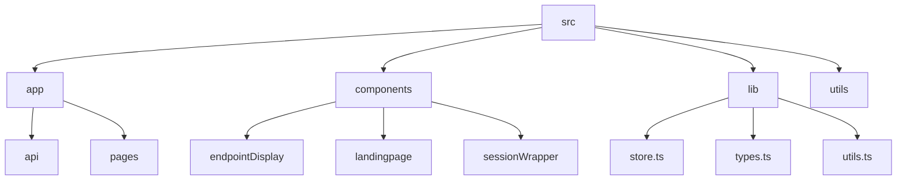

# Lazy Ping

## 🗂️ Description

Lazy Ping is a web application designed to monitor and ping API endpoints at regular intervals. The project aims to provide a simple and efficient way to check the status of multiple endpoints, helping developers and teams ensure their APIs are functioning correctly. This project is ideal for developers, DevOps teams, and anyone responsible for maintaining API endpoints.

## ✨ Key Features

### **Core Features**
- **Endpoint Management**: Add, edit, and delete API endpoints to monitor.
- **Automated Pinging**: Endpoints are pinged at regular intervals to check their status.
- **Status Monitoring**: View the status of each endpoint, including successful pings and failures.
- **Alerts and Notifications**: Receive notifications for endpoint failures or changes in status.

### **User Interface**
- **Dashboard**: A user-friendly dashboard to view and manage all endpoints.
- **Project Management**: Organize endpoints by projects for better management.

## 🗂️ Folder Structure



## 🛠️ Tech Stack


## ⚙️ Setup Instructions

To run Lazy Ping locally, follow these steps:

1. **Clone the Repository**:
   ```bash
   git clone https://github.com/abhraneeldhar7/lazy-ping.git
   ```
2. **Install Dependencies**:
   ```bash
   cd lazy-ping
   npm install
   ```
3. **Configure Environment Variables**:
   - Create a `.env` file in the root directory.
   - Add your Supabase and NextAuth credentials.

4. **Start the Development Server**:
   ```bash
   npm run dev
   ```
5. **Access the Application**:
   Open your browser and navigate to `http://localhost:3000`.

## 🤖 GitHub Actions

The project uses a GitHub Actions workflow to ping an endpoint every 10 minutes. This is defined in `.github/workflows/ping.yml`.

```yml
name: Ping Endpoint
on:
  schedule:
    - cron:  */10 * * * *
jobs:
  ping:
    runs-on: ubuntu-latest
    steps:
      - name: Ping Endpoint
        run: curl https://example.com/ping
```

## 📝 Additional Information

- **Supabase Functions**: Server-side functions interacting with the Supabase database are located in `app/actions/supabaseFunctions.ts`.
- **Endpoint Display**: The component for displaying and managing endpoints is in `components/endpointDisplay/endpointDisplay.tsx`.


<br><br>
<div align="center">

<h3>Abhra the Neel</h3>
<p>Full-stack developer with expertise in web, Android, and server-side development. Most projects are private due to being production code.</p>
</div>
<br>
<p align="right">
  <a href="https://gitfull.vercel.app">Made by GitFull</a>
</p>
    